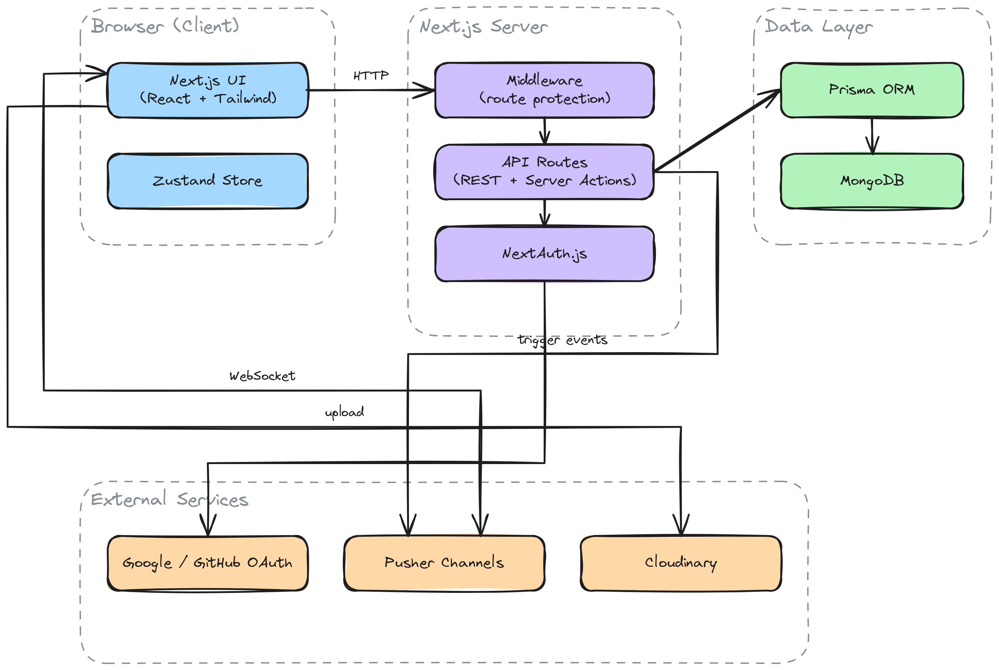
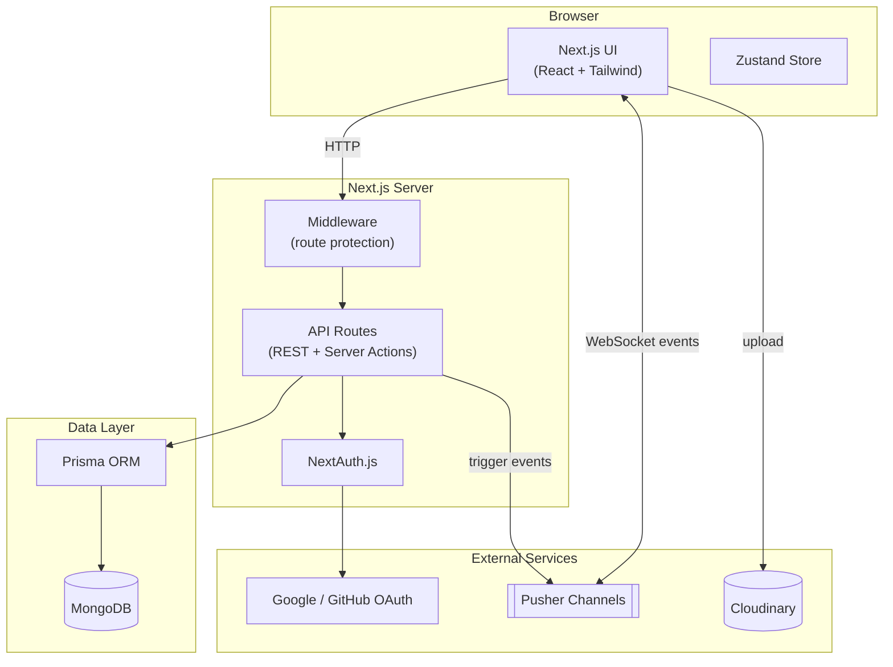

# Connectopia

A real-time messaging application built with Next.js, supporting one-on-one and group conversations, presence tracking, read receipts, and media sharing.



<details>
<summary>UI Preview</summary>


</details>

**Live demo:** https://connectopia-social-media-app.vercel.app/

## Features

- Authentication via credentials, Google, and GitHub (NextAuth.js)
- Real-time messaging, typing status, and delivery updates (Pusher)
- One-on-one and group conversations
- Online presence tracking and read receipts
- Image and file attachments (Cloudinary)
- User profile and conversation management

## Tech Stack

| Layer          | Technology                                  |
| -------------- | -------------------------------------------- |
| Framework      | [Next.js](https://nextjs.org/) (App Router) |
| Language       | TypeScript                                   |
| Styling        | [Tailwind CSS](https://tailwindcss.com/)     |
| State          | [Zustand](https://zustand-demo.pmnd.rs/)     |
| Forms          | [React Hook Form](https://react-hook-form.com/) |
| Auth           | [NextAuth.js](https://next-auth.js.org/)     |
| Database       | [MongoDB](https://www.mongodb.com/)          |
| ORM            | [Prisma](https://www.prisma.io/)             |
| Real-time      | [Pusher](https://pusher.com/)                |
| Media storage  | [Cloudinary](https://cloudinary.com/)        |

## Architecture



Editable source for the architecture diagram: [docs/architecture.excalidraw](docs/architecture.excalidraw) (open at [excalidraw.com](https://excalidraw.com)).

Client components call REST endpoints and server actions under `app/api` and `app/actions`. Auth is handled by NextAuth with credentials and OAuth providers, backed by the Prisma adapter. Messages and conversation state are persisted in MongoDB via Prisma, while Pusher broadcasts events (new messages, presence, read receipts) to subscribed clients. Media uploads go directly to Cloudinary from the client.

## Getting Started

### Prerequisites

- Node.js 18.18+ (or 20.9+ / 22.11+)
- A MongoDB connection string
- Pusher, Cloudinary, and OAuth (Google/GitHub) credentials

### Setup

```sh
git clone https://github.com/isSubham/connectopia-social-media-app.git
cd connectopia-social-media-app
npm install
```

Create a `.env` file in the project root:

```env
DATABASE_URL=
NEXTAUTH_SECRET=
GITHUB_ID=
GITHUB_SECRET=
GOOGLE_CLIENT_ID=
GOOGLE_CLIENT_SECRET=
NEXT_PUBLIC_CLOUDINARY_CLOUD_NAME=
PUSHER_APP_ID=
NEXT_PUBLIC_PUSHER_KEY=
PUSHER_SECRET=
```

Push the Prisma schema to your database:

```sh
npx prisma db push
```

Start the development server:

```sh
npm run dev
```

## Project Structure

```
app/
├── (root)/          Landing / auth page
├── actions/          Server actions (data fetching)
├── api/               REST API routes (auth, conversations, messages, register, settings)
├── components/        Shared UI components
├── context/           React context providers
├── conversations/     Conversation list and chat views
├── hooks/             Custom React hooks
├── lib/               Prisma and Pusher clients
├── types/             Shared TypeScript types
└── users/             User directory
prisma/
└── schema.prisma      Database schema
```

## Author

**Subham Haldar**

- GitHub: [@isSubham](https://github.com/issubham)
- LinkedIn: [isSubham](https://www.linkedin.com/in/issubham/)
